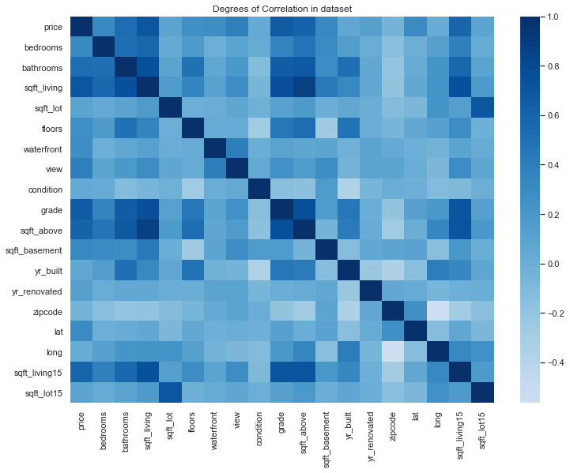
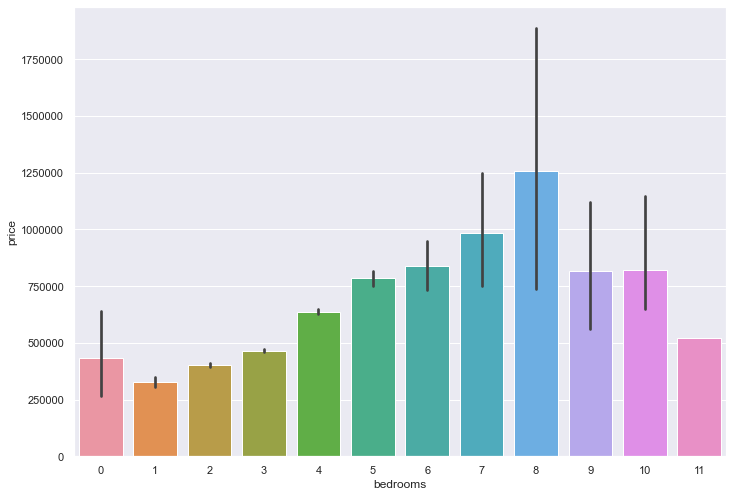
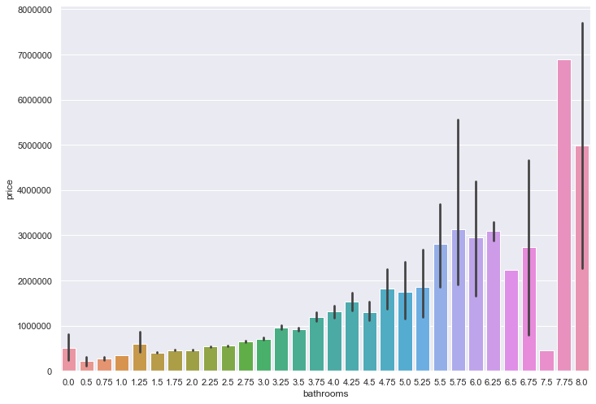
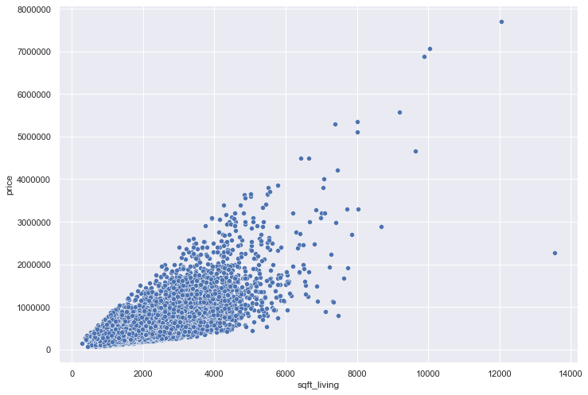
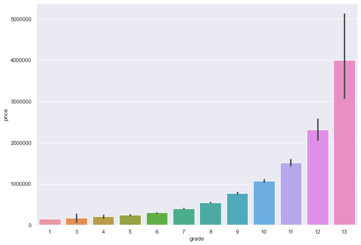
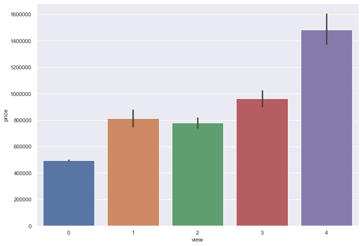
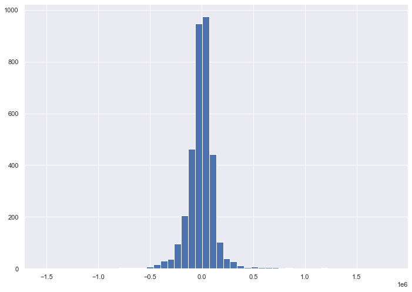
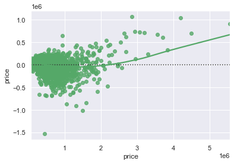

# King County Housing Data Analysis

## Creating a predictive model for housing prices

<li>The goal of this project was to predict the prices of homes found in King County, Washington, based on data made available by the county.

## Part 1: Inference

 

<li>Peform EDA on a training data set

<li>Clean the data

<li>Feature Engineering

<li>Create visuals

<li>Performstatistical tests

## Part 2: Predictive Modeling
 

<li>Create prediction model using linear regression and apply it to a holdout data set

### The Training Data:
 

<li>The Training data set contained 21 columns and 17,290 rows

### Column Names:
 

<li> id - the id of each home sold

<li>date - the date the home was sold

<li>price - the price of the home soldprice - the price of the home sold

<li>bedrooms - number of bedrooms

<li>bathrooms - number of bathrooms

<li>sqft_living - square footage of living area

<li>sqft_lot - square footage of lot

<li>floors - number of floors

<li>waterfront - whether the home is on the waterfront

<li>view - quality of the view

<li>condition - overall condition of the home

<li>grade - overall grade assigned to the home based on 

<li>sqft_above - square footage above ground

<li>sqft_basement - square footage of the basement

<li>yr_built - year the home was built

<li>yr_renovated - year the home was renovated

<li>zipcode - zipcode where the home is located

<li>lat - lattitude of the home

<li>long - longitutde of the home

<li>sqft_living15 - square footage of living area of the 15 closest homes

<li>sqft_lot15 - square footage of the lot of the 15 closest homes

### The Holdout Data:
 
<li>The hold out dataset contained 19 columns and 4322 rows

### Data cleaning
 
<li>Some homes were listed as containing 0 bedrooms. These values were reassigned to 1.

    
<li>One home was listed as containing 33 bedrooms. Upon checking Google Maps, it was discovered that this was a typo and the number was reassigned to 3.

    
<li>Some home were listed as containing 0 bathrooms. These values were reassigned to 1.

    
<li>Many values for year renovated were listed as 0 if the home had not been renovated. These values were reassigned to match the year built.

    
<li>The dates the homes were built was reassigned to the data time format.

### Feature engineering
 

**Several new categories were created:**

     
    
<li>Whather or not a home contains a basement

    
<li>Price per square foot. This was omitted from the final model

    
<li>Bedroom to bathroom ratio

    
<li>Yard space

     
    
**In addition to creating new features, dummy columns were also created for 7 existing categories:**

 
    
<li>Bedrooms

    
<li>Bathrooms - the number of bathrooms were grouped together as integers

    
<li>Floors

    
<li>Grade - the grades were grouped together into larger categories

    
<li>View

    
<li>Zipcode

    
<li>Condition

### Hypothesis Testing

 

**In order to determine which features should be included in the final model, multiple statistical tests were performed:**

 

<li>Pearson correlation 

    
<li>ANOVA (f-test)

    
<li>Ordinary least squares

    
<li>2 sample t-test

## Modeling

 

**My intial modeling was based on existing categories with high pearson correlation coefficients, I selected:**

 

<li>bedrooms
<li>bathrooms
<li>sqft-living
<li>grade
<li>view
<li>zipcode

     
    
**The RMSE based on these features was 234,716.01. This value was too high.**

**My subsequent modeling included most of the categories, excluding categories for which dummy columns were created, as well as price and date.**

 

**After performing a train test split on the data, I received an RMSE of 157,106 on the training set and 155,671 on the testing set. These results were much better than my initial test.**

 

**I created another model using PolynomialFeatures and SelectKBest, which selected 20 features, and received an RMSE of 205,503.34 on the training set. This value was also too high.**

 

**In the end I went with my second model. While this model included over 100 features, it returned the best results.**

**In the histogram below, the residuals are almost normally distributed**

**In the scatterplot below, the residuals are scattered randomly at the lower end with some bias appearing as price increases**

### Conclusion
 
In constructing my model, I found that using a wide variety of features, including dummy features, provided me with the most accurate predictions.

